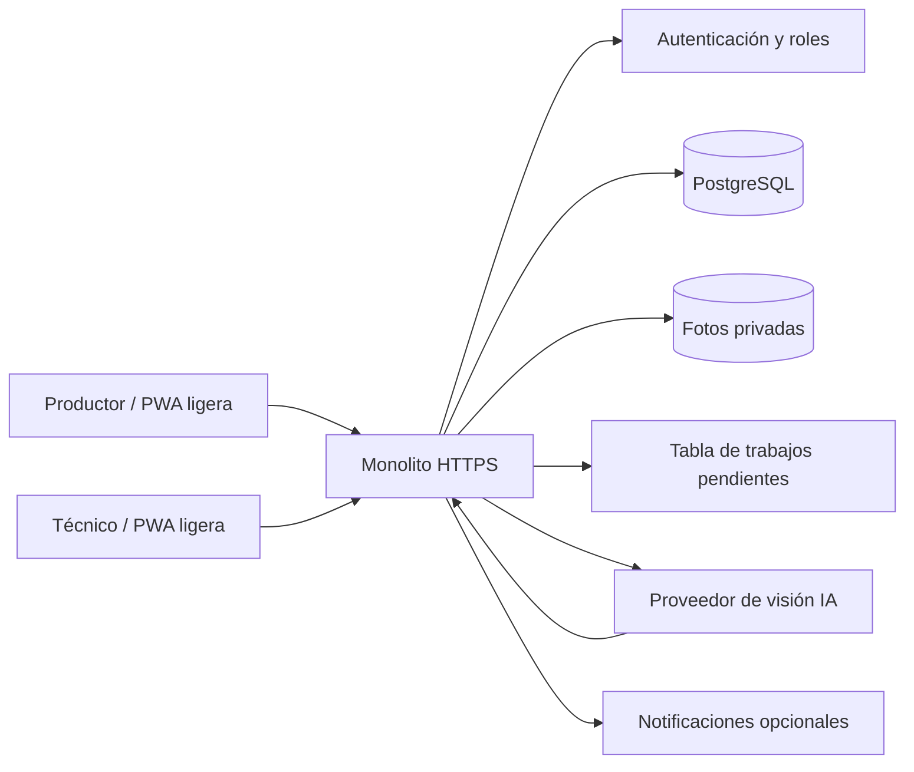

# Plan de despliegue: Jitomate Atento

## 1. Objetivo

Convertir el MVP actual, que hoy vive como una página estática en GitHub Pages, en una PWA capaz de:

- Atender de 50 a 200 usuarios registrados.
- Permitir que un productor tome o suba fotos de insectos.
- Solicitar una consulta de IA para sugerir una identificación.
- Enviar la identificación al técnico antes de comunicar una alerta validada.
- Guardar lotes, mediciones, fotos, decisiones y bitácora.
- Seguir funcionando con conectividad irregular en campo.

**Supuesto de capacidad:** 50 a 200 usuarios registrados, con 10 a 30 usuarios activos al mismo tiempo y hasta 5 consultas de imagen por usuario al día. Si se esperan 50 a 200 usuarios simultáneos, habrá que repetir la prueba de carga y ampliar la configuración.

**Fecha de revisión de precios:** 2 de octubre de 2026. Los precios cambian, pueden no incluir impuestos, tipo de cambio, promociones o cargos de IA. Confirmar el carrito y la calculadora antes de pagar.

## 2. Requisitos de dispositivo

### Productor

| Requisito | Mínimo recomendado | Motivo |
|---|---|---|
| Sistema | Android 8 o posterior; iPhone con Safari reciente | Soporte razonable para PWA, cámara y almacenamiento local |
| Memoria | 2 GB de RAM | Evitar cierres al tomar/comprimir una foto |
| Almacenamiento | 150 MB libres | PWA, caché, cola temporal y fotos pendientes |
| Pantalla | 360 × 640 px; probar especialmente 390 × 844 px | Lectura de la respuesta "hoy riega" / "hoy no riegues" |
| Cámara | 8 MP o mejor, enfoque automático | Capturar insecto, hoja y escala de referencia |
| Conectividad | 3G/4G intermitente; Wi-Fi cuando sea posible | Registrar datos sin depender de una conexión continua |
| Navegador | Chrome Android o Safari actualizado | Instalación y permisos de cámara |
| Batería | Al menos 20% para una visita de campo | Evitar perder una foto o una sincronización |

La app no debe instalarse desde una tienda para el piloto: será una PWA instalada desde el navegador. La foto se comprime en el teléfono antes de subirla; objetivo de 200 a 500 KB y máximo de 1,280 px en su lado mayor.

### Técnico

- Celular Android con 3 GB de RAM o computadora básica con 4 GB de RAM.
- Cámara con enfoque automático y espacio libre de 500 MB si captura muchas fotos.
- Conexión 4G o Wi-Fi para revisar imágenes y cargar evidencia.
- Navegador actualizado y permisos de cámara habilitados.
- Opcional: tensiómetro o sensor de humedad, cinta de escala, trampas y formato de registro.

### Equipo del servidor

Para la primera versión del monolito, con la IA ejecutándose fuera del teléfono y fuera de la instancia:

- 2 vCPU.
- 2 GB de RAM como punto de partida; 4 GB si el servidor hará redimensionado pesado o más de 30 usuarios concurrentes.
- 20 GB SSD para la aplicación, logs y temporales.
- Base de datos PostgreSQL administrada con al menos 1 GB y respaldo diario.
- Almacenamiento privado para fotos; no guardar originales indefinidamente.
- HTTPS, dominio propio y al menos 100 GB mensuales de transferencia inicial.
- Linux administrado o contenedor; Node.js 20+ o .NET 8+, según la tecnología que el equipo pueda mantener.

No se recomienda ejecutar un modelo de visión grande dentro del celular ni en un VPS pequeño. La consulta debe ir a un proveedor externo o a un modelo ligero alojado después de medir su consumo.

## 3. Principio de operación

La IA no da un diagnóstico definitivo ni recomienda agroquímicos. Su resultado debe tener tres estados:

1. **Sugerencia de IA:** posibles insectos, confianza, señales observadas y solicitud de más datos si la foto no es suficiente.
2. **Revisión del técnico:** confirma, corrige o marca "no concluyente".
3. **Mensaje al productor:** solo se muestra una recomendación validada; si no hay certeza, se pide monitorear y tomar otra foto.

Una foto nunca debe activar por sí sola una aplicación química.

## 4. Arquitectura monolítica propuesta para el MVP

La primera versión debe ser un **monolito modular**: una sola aplicación desplegable que sirva la PWA, exponga la API, gestione usuarios, guarde datos y ejecute el flujo de consulta de IA. No habrá microservicios ni un worker separado al inicio.

Esto reduce complejidad, costo, puntos de falla y trabajo de operación. La separación se hará dentro del código por módulos para poder extraer el procesamiento de imágenes más adelante si el uso crece.



### Componentes recomendados

| Componente | Opción simple para el piloto | Responsabilidad |
|---|---|---|
| Aplicación monolítica | ASP.NET Core Minimal API o Node.js con Fastify/Express, sirviendo también los archivos estáticos | Usuarios, lotes, riego, fotos, IA, alertas y bitácora en un solo despliegue |
| Frontend | HTML, CSS y JavaScript ligero; conservar la lógica actual y modularizar después | Interfaz productor/técnico, cámara, modo sin conexión y sincronización |
| Hosting | Una sola instancia pequeña con HTTPS | Sirve PWA y API desde el mismo dominio |
| Base de datos | PostgreSQL administrado | Datos de usuarios, lotes, mediciones, predicciones y validaciones |
| Fotos | Carpeta privada del servidor al inicio o Object Storage compatible con S3 | Archivos reducidos, con acceso privado y política de borrado |
| Procesamiento | Servicio interno del monolito + tabla `ai_jobs` | Redimensionar, revisar formato, llamar a IA y guardar resultado |
| IA de imagen | API de visión llamada únicamente desde el servidor | Clasificación preliminar; permite cambiar de proveedor después |
| Observabilidad | Logs estructurados, errores y métricas | Detectar fallos, tiempos, costo por consulta y uso |

Para 50 a 200 usuarios no conviene comenzar con Kubernetes ni microservicios. Una instancia del monolito, PostgreSQL y almacenamiento privado son suficientes. La tabla de trabajos permite procesar consultas sin perderlas aunque la IA tarde o falle.

### Estructura interna del monolito

```text
app/
  auth/              usuarios, sesiones y roles
  plots/             productores y lotes
  irrigation/        simulación y recomendaciones
  pest-risk/          reglas de riesgo y trampas
  photos/             carga, compresión y permisos
  ai/                 proveedor de visión y estados de consulta
  reviews/            validación técnica y bitácora
  web/                PWA, manifest, service worker y pantallas
```

La IA debe tener una interfaz interna como `identifyInsect(image)` para cambiar de proveedor sin modificar las pantallas ni las reglas agronómicas.

## 5. Flujo de una consulta de foto

1. El productor abre **Identificar insecto** y toma una foto.
2. La app comprime la imagen en el celular y muestra que es un **dato de campo**.
3. La API valida sesión, lote, tamaño y tipo de archivo.
4. El monolito crea una consulta con estado `pendiente` y guarda una referencia a la foto.
5. El celular sube la foto comprimida al mismo servidor o al almacenamiento privado configurado.
6. El monolito registra un trabajo en `ai_jobs` y devuelve la pantalla de espera; la petición HTTP termina rápido.
7. Un proceso interno del monolito toma trabajos pendientes de uno en uno, elimina metadatos, verifica calidad y llama al modelo.
8. La IA devuelve una lista de posibles identificaciones, confianza y `no_concluyente` cuando corresponda.
9. La PWA consulta el estado cada 5 segundos o recibe una notificación cuando el análisis termina.
10. El técnico recibe la tarea en su bandeja.
11. El técnico confirma, corrige o rechaza la sugerencia y registra evidencia.
12. La app muestra al productor solo la decisión validada y una acción de monitoreo.

Si el proceso interno se reinicia, los trabajos `pendientes` se vuelven a intentar. Si la cantidad de trabajos supera el límite, la app informa que la consulta quedó en espera; no se deben crear procesos ilimitados.

### Reglas de seguridad del resultado

- Confianza baja o foto borrosa: no identificar; pedir otra foto.
- Resultado sin revisión humana: no mostrar como diagnóstico.
- La IA debe devolver siempre una opción `no_concluyente`.
- Guardar versión del modelo, fecha, proveedor y prompt/configuración.
- No enviar al proveedor de IA nombres, teléfonos ni ubicación exacta si no son necesarios.
- No usar fotos de productores para entrenar modelos sin consentimiento separado.

## 6. Datos mínimos

### Tablas principales

- `users`: usuario, rol (`productor`, `tecnico`, `admin`), estado y fecha de alta.
- `farms`: productor, municipio, ubicación aproximada y consentimiento.
- `plots`: cultivo, variedad, superficie, fecha de trasplante, suelo y riego.
- `weather_records`: fecha, origen, temperatura, lluvia y calidad.
- `soil_measurements`: lote, fecha, valor, unidad, instrumento y si es ejemplo.
- `trap_counts`: lote, fecha, plaga, conteo, método y técnico.
- `photo_cases`: lote, usuario, estado, fecha, archivo y consentimiento.
- `ai_predictions`: caso, modelo, candidatos, confianza y respuesta completa.
- `expert_reviews`: caso, técnico, decisión, nota y fecha.
- `recommendations`: riego/monitoreo, estado de validación y evidencia.
- `audit_events`: quién cambió qué, cuándo y desde dónde.

Todo dato de demostración debe tener `is_example = true`. No mezclarlo con mediciones del piloto.

## 7. PWA

### Primera versión

- `manifest.webmanifest` con nombre, iconos, color y `display: standalone`.
- `service-worker.js` para cachear la interfaz, CSS, iconos y última información no sensible.
- HTTPS obligatorio.
- Botón visible de **Sin conexión** y cola local para mediciones y fotos pendientes.
- IndexedDB para guardar temporalmente formularios, no credenciales ni resultados sensibles sin protección.
- Sincronización al recuperar señal, con reintentos y estado visible.
- La captura de foto debe limitar tamaño, formato y orientación.

### Reglas para celulares de baja gama

- JavaScript sin framework pesado en la primera versión; evitar bundles grandes y animaciones innecesarias.
- Cargar primero el texto y los controles principales; gráficos y fotos se cargan después.
- Usar imágenes de interfaz comprimidas y pocos iconos; no descargar fuentes grandes.
- Comprimir la foto en el dispositivo antes de subirla: lado mayor de 1,280 px y objetivo de 200 a 500 KB. Mantener el original solo si es indispensable.
- Preferir WebP y aceptar JPEG como respaldo; rechazar videos y fotos mayores de 5 MB.
- No ejecutar el modelo de IA en el celular: la app solo captura, comprime y envía.
- Mostrar progreso y permitir reintentar; una pantalla congelada se interpreta como falla de red.
- Evitar mapas en tiempo real, tablas anchas y consultas simultáneas.
- Probar con Android de entrada, 2 GB de RAM, almacenamiento limitado y red 3G/4G inestable.
- Servir la PWA y la API desde el mismo dominio para reducir redirecciones y configuración.

### No guardar sin conexión

- Tokens de sesión en texto plano.
- Fotos permanentes sin cifrado o sin política de borrado.
- Recomendaciones como validadas si el técnico no las confirmó.

## 8. Capacidad para 50 a 200 usuarios

### Escenario de diseño

- 200 cuentas registradas.
- 30 usuarios concurrentes como objetivo inicial.
- 5 fotos por usuario al día: hasta 1,000 consultas diarias en el caso máximo del supuesto.
- Límite inicial: 10 fotos por usuario al día y 2 trabajos simultáneos por usuario.
- Tamaño recomendado: foto comprimida de 1 a 3 MB; guardar original solo si existe consentimiento y necesidad técnica.
- Procesamiento asíncrono: la app no debe esperar la respuesta de IA en la misma petición HTTP.
- Una sola instancia del monolito puede ejecutar como máximo 1 o 2 trabajos de IA a la vez; el resto queda en `ai_jobs`.
- La respuesta de la carga debe llegar en menos de 2 segundos sin contar el análisis de IA; la app consulta el estado después.

### Límites y protección

- Rate limit por usuario y por IP.
- Cuota de almacenamiento por lote.
- Límite de tamaño y tipos MIME; nunca confiar solo en la extensión.
- Timeout del proveedor de IA y reintento con backoff.
- Circuit breaker: si la IA falla, la app ofrece registrar observación y enviar al técnico.
- Idempotencia para no cobrar dos veces la misma foto por reintentos.
- Paginación en bitácoras y consultas.

## 9. Seguridad y privacidad en México

Antes del piloto:

- Aviso de privacidad sencillo y consentimiento para fotos y ubicación.
- Explicar quién puede ver la foto: productor, técnico y administrador autorizado.
- Contratos de encargado/proveedor cuando las fotos salgan a un servicio externo.
- Cifrado en tránsito y almacenamiento privado.
- Roles con mínimo privilegio.
- Copias de seguridad y prueba de restauración.
- Borrado de fotos originales después del plazo definido, conservando solo la evidencia necesaria.
- Registro de accesos y cambios de validación.
- No recopilar ubicación exacta si una ubicación aproximada basta para el modelo.

Validar el aviso y los contratos con asesoría legal mexicana antes de operar con datos personales reales.

## 10. Plan por fases

### Fase 0: decisión de producto, 1 día

- Definir qué especies o grupos se reconocerán primero.
- Definir el formato de foto: insecto completo, hoja y escala de referencia.
- Definir quién valida y en cuánto tiempo.
- Fijar el significado de "alerta", "sugerencia" y "diagnóstico".
- Definir métricas de éxito.

**Salida:** especificación breve y lista de casos que la IA puede marcar como `no_concluyente`.

### Fase 1: PWA base, 2 a 4 días

- Agregar manifest, iconos, service worker y pantalla de instalación.
- Separar el estado local actual del futuro cliente API.
- Agregar login real y roles.
- Crear formularios de lotes y mediciones.
- Probar instalación en Android y iPhone.

**Salida:** PWA instalable que registra datos aun con conectividad intermitente.

### Fase 2: monolito y datos, 3 a 5 días

- Una sola aplicación HTTPS que sirva la PWA y la API.
- API con validación y módulos internos separados.
- PostgreSQL con migraciones.
- Almacenamiento privado; URLs temporales solo si se usa Object Storage.
- Tabla `ai_jobs` y proceso interno con límite de concurrencia, reintentos y estados.
- Bitácora de auditoría.
- Pruebas de permisos: productor no ve otro lote; técnico solo ve lotes asignados.

**Salida:** datos persistentes y controlados.

### Fase 3: IA y revisión humana, 4 a 7 días

- Subida de foto y tabla de trabajos dentro del monolito.
- Servicio interno de análisis de imagen.
- Contrato de respuesta de IA.
- Bandeja del técnico.
- Estados pendiente, validada, corregida y no concluyente.
- Guardar modelo, confianza y evidencia.

**Salida:** primera consulta de insecto con supervisión humana.

### Fase 4: piloto controlado, 2 a 4 semanas

- 10 a 20 productores y 1 a 3 técnicos.
- Comparar foto, conteo de trampa y decisión experta.
- Medir tiempo de respuesta, fotos rechazadas, precisión por grupo y falsos negativos.
- No tomar decisiones fitosanitarias automáticas.

**Salida:** datos reales para decidir si se amplía a 50 y luego 200 usuarios.

### Fase 5: escala inicial, 1 semana

- Prueba de carga con 30 usuarios concurrentes y ráfagas de fotos.
- Ajustar el límite de trabajos internos, límites de carga, índices de base de datos y almacenamiento.
- Alertas operativas y procedimiento de rollback.
- Capacitar técnicos y publicar manual.

## 11. Pruebas de aceptación

### Funcionales

- Un productor puede instalar la PWA, crear un lote y registrar humedad sin conexión.
- Una foto se carga con conexión y queda en estado pendiente.
- Una foto borrosa no se presenta como identificación.
- Un técnico puede validar o corregir la sugerencia.
- El productor no ve el resultado como confirmado antes de la validación.
- Se conserva la bitácora de cada cambio.

### Técnicas

- Prueba de carga con 30 usuarios concurrentes.
- Prueba de 1,000 fotos diarias simuladas o con un volumen representativo.
- Recuperación ante caída del proveedor de IA.
- Restauración de la base de datos.
- Verificación de permisos y URLs temporales.
- Prueba en Android de gama media y iPhone con red lenta.
- Prueba en Android de baja gama con 2 GB de RAM y red 3G/4G inestable.
- Lighthouse/PWA y prueba a 390 px de ancho.

### Agronómicas

- Conjunto de fotos etiquetadas por técnico o fitopatólogo.
- Separar entrenamiento, validación y prueba; no medir con las mismas fotos usadas para ajustar.
- Reportar precisión, cobertura, falsos positivos y falsos negativos por grupo.
- Comparar siempre contra el criterio del experto y el conteo de trampas.

## 12. Comparación de proveedores

Los importes siguientes son los publicados en las páginas oficiales consultadas el 2 de octubre de 2026. Están en USD cuando el proveedor así los publica. Para una conversión de planeación únicamente puede usarse `USD x tipo de cambio del día`; no se presenta una conversión fija como precio contractual.

| Opción | Precio publicado relevante | Qué incluye o qué falta | Evaluación para este proyecto |
|---|---:|---|---|
| HostGator Web Hosting México | Personal: $120 MXN/mes mensual; Emprendedor: $214.50; Negocios: $315.50; Turbo: $389. Precios regulares publicados, no necesariamente promoción | Hosting compartido. La página no garantiza un proceso monolítico persistente, cola interna ni control suficiente para IA/API | Bueno para una landing o archivos estáticos; no lo elegiría para el backend con fotos e IA sin confirmar VPS, Node/.NET, procesos y respaldos |
| HostGator VPS México | Publica "desde $62 MXN/mes" promocional en la página consultada | El precio mostrado no permitió verificar en el contenido accesible CPU, RAM, renovación ni backups incluidos | Puede ser barato si el plan confirma al menos 2 vCPU, 2 GB RAM, Ubuntu, HTTPS, backups y proceso persistente; pedir cotización completa antes de contratar |
| AWS Lightsail | Precio dinámico en la página oficial; no se fijó una cifra porque el sitio no cargó la tabla en esta consulta | VPS sencillo, red, disco y transferencia; PostgreSQL, S3 y servicio de IA se cobran aparte | Adecuado técnicamente, pero requiere más configuración, monitoreo y control de costos. Mejor para una segunda etapa o si alguien del equipo ya domina AWS |
| Railway Hobby | $5/mes, incluye $5 de uso; recursos se cobran por segundo; memoria publicada aprox. $10/GB/mes y CPU aprox. $20/vCPU/mes | Despliegue sencillo, dominio y servicios; base de datos y almacenamiento agregan consumo | Muy buen costo para prototipo monolítico. Vigilar el límite de $5 y configurar alertas de gasto |
| Render | Hobby $0 + cómputo; servicio web de 512 MB: $7/mes; servicio de 2 GB: $25/mes; PostgreSQL de 1 GB: $19/mes | HTTPS, despliegue desde Git y Postgres administrado; almacenamiento de disco $0.25/GB/mes | Fácil de operar, pero la combinación producción mínima de 2 GB + Postgres ronda $44/mes antes de fotos e IA |
| Supabase + un host monolítico | Supabase Free: $0, 500 MB DB, 1 GB archivos, 5 GB egress, pausa por inactividad. Pro: desde $25/mes, 8 GB DB, 100 GB archivos, respaldos diarios 7 días | Auth, Postgres y Storage integrados; el monolito todavía necesita un host para la API | Muy buen costo-beneficio si se acepta separar datos administrados del proceso monolítico. Pro evita pausas y simplifica seguridad, pero sube el costo fijo |

### IA por imagen

Google Cloud Vision publica 1,000 unidades gratuitas mensuales para varias funciones; después, Label Detection cuesta $1.50 por 1,000 unidades y Object Localization $2.25 por 1,000 unidades en el primer tramo publicado. Eso sirve como referencia de costo de una API de visión genérica, pero **no garantiza identificar plagas agrícolas**. Un modelo multimodal o especializado puede tener otro precio y debe evaluarse con fotos reales.

Fuentes consultadas:

- HostGator México: https://www.hostgator.mx/precios-hostgator y https://www.hostgator.mx/vps/
- Railway: https://railway.com/pricing
- Render: https://render.com/pricing
- Supabase: https://supabase.com/pricing
- AWS Lightsail: https://aws.amazon.com/lightsail/pricing/
- Google Cloud Vision: https://cloud.google.com/vision/pricing

## 13. Recomendación de costo-beneficio

### Opción recomendada para el piloto técnico: Railway Hobby + base de datos PostgreSQL

Usar una sola aplicación monolítica en Railway y PostgreSQL como servicio de datos del mismo proyecto. El precio base publicado de Railway Hobby es $5 USD/mes con $5 USD de uso incluido; el costo final depende de CPU, RAM, volumen, transferencia y consultas de IA.

Esta opción minimiza operación y mantiene la arquitectura monolítica. Antes de guardar fotos reales se debe confirmar el respaldo del volumen; si no es suficiente, mover únicamente las fotos a un almacenamiento de objetos, manteniendo la aplicación como un monolito.

### Opción más sencilla para producción pequeña: Render + Postgres

Elegir un servicio web de 2 GB ($25 USD/mes) y PostgreSQL de 1 GB ($19 USD/mes), aproximadamente $44 USD/mes antes de almacenamiento, transferencia e IA. Es más caro que Railway, pero sus precios y recursos son más fáciles de leer y tiene despliegue y respaldos administrados.

### Opción si priorizan autenticación y fotos: host monolítico + Supabase Pro

Usar un host económico para el monolito y Supabase Pro desde $25 USD/mes para Auth, PostgreSQL y Storage. No es un monolito de infraestructura total, pero la aplicación sigue siendo un solo backend; Supabase funciona como servicios administrados. Es la opción que elegiría si el equipo no quiere implementar autenticación, URLs privadas y almacenamiento desde cero.

### HostGator y AWS

- **HostGator:** contratar solo después de confirmar por escrito recursos, procesos persistentes, Node/.NET, SSL, backups y precio de renovación. El hosting compartido no es suficiente para esta app.
- **AWS:** no empezar con EC2 + RDS + S3 + Rekognition en el hackatón. Es potente, pero el costo real exige calculadora y experiencia operativa. Usarlo cuando necesiten controles de red, escalamiento o integración empresarial.

## 14. Costos: cómo presupuestarlos sin engañarse

No conviene fijar una cifra única antes de elegir proveedor. El costo variable principal será el análisis de imágenes y el almacenamiento. El presupuesto debe separar:

- Aplicación monolítica: un plan administrado pequeño durante el piloto.
- PostgreSQL: instancia administrada con copias de seguridad.
- Fotos: almacenamiento más transferencia y retención.
- IA: precio por imagen o por tokens, según el proveedor; medir costo real por consulta.
- Dominio, correo y monitoreo.
- Honorarios del técnico y fitopatólogo, que son parte del costo del producto.

Usen esta fórmula mensual antes de contratar:

`costo mensual = infraestructura fija + (consultas de imagen x costo por consulta) + almacenamiento + transferencia + soporte agronómico`

Crear una alerta de presupuesto y un límite duro de consultas evita que una prueba o un error genere cargos inesperados.

## 15. Recomendación final

Para el primer despliegue usaría:

1. Un monolito HTTPS que sirva la PWA y la API desde el mismo origen.
2. JavaScript ligero, compresión local de fotos y modo sin conexión.
3. PostgreSQL administrado.
4. Almacenamiento privado de fotos, local en la primera prueba o Object Storage si crece.
5. Tabla de trabajos y procesamiento interno limitado a 1 o 2 consultas de IA simultáneas.
6. Un proveedor de visión intercambiable detrás de una interfaz propia.
7. Revisión obligatoria de técnico.
8. Piloto de 10 a 20 productores antes de abrirlo a 50–200.

Cuando el monolito llegue a su límite, el primer componente que conviene extraer es el procesamiento de imágenes, no toda la aplicación. La API y la PWA pueden seguir siendo monolíticas mientras la base de usuarios crece.

El objetivo del primer despliegue no es demostrar que la IA identifica todos los insectos. Es demostrar que la app registra evidencia de calidad, dirige los casos inciertos al técnico y mejora la oportunidad del monitoreo sin inventar certezas.
